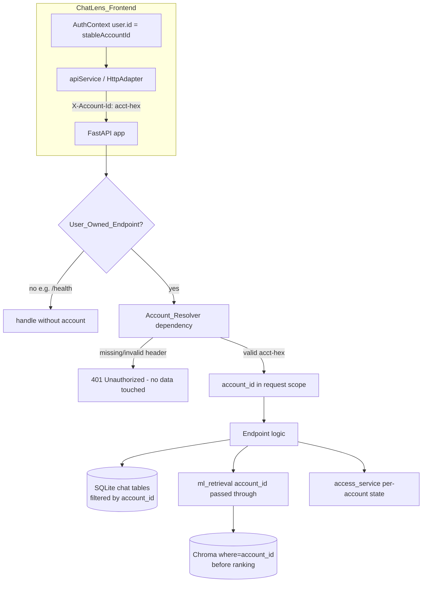
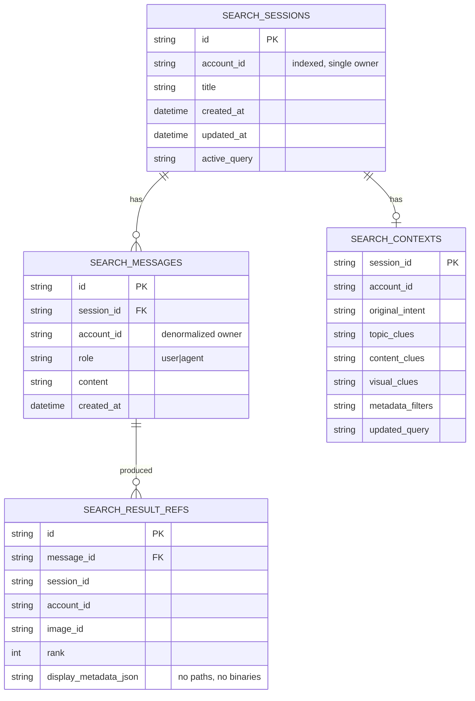
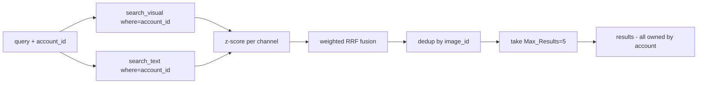
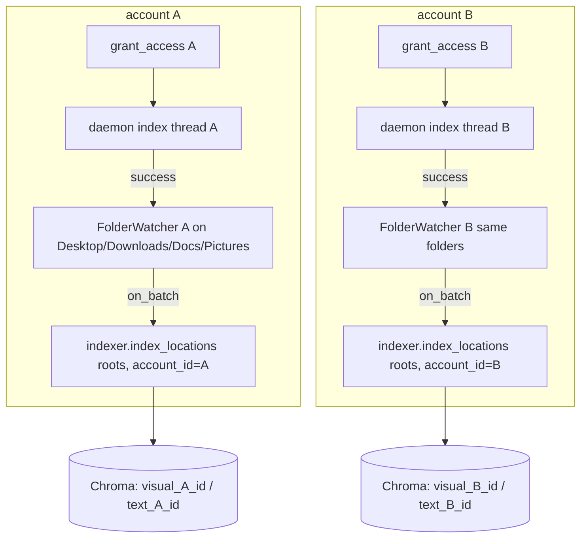

# Design Document — Account-Scoped Chat and Isolation (Phase 1)

## Overview

This design turns the currently "single implicit global account" ChatLens backend
into an **application-level, account-scoped** system without redesigning retrieval,
ranking, security, or the dev-only auth model. It is a **safe, incremental refactor**
of the existing architecture (`backend/`, `ml/`, `frontend/src/`), grounded in the
code confirmed by the audit and re-verified while writing this document.

The refactor rests on one new idea — an **Account Identity Bridge** — plus the
disciplined threading of a single `account_id` value through the existing layers:

- The frontend already derives a stable id (`DevAuthService.stableAccountId(email)`
  → `acct-<hex>`). Phase 1 sends it as an `X-Account-Id` header (no new auth).
- The backend resolves that header into an `account_id` on every user-owned
  endpoint and then **restricts every read and write** for that request to the
  resolved account.
- Chat conversations become **durable and account-owned** by reviving the three
  dead tables (`SearchSession`/`SearchMessage`/`SearchContext`) with an owner column
  plus a small result-reference structure.
- Chroma records are **tagged with `account_id`** and retrieval filters candidates
  with a Chroma `where={"account_id": ...}` clause **before** ranking/fusion/dedup,
  so no cross-account record ever enters the ranked set.
- Access state, the authorized-locations file, indexing threads, and the folder
  watcher all move from **process-global singletons** to **per-account maps**.

Everything else — the hybrid RRF retrieval algorithm, the 0–100 cosine similarity,
`Max_Results=5`, canonical dedup, the realpath/source-root/extension security checks,
and the Desktop/Downloads/Documents/Pictures-only scan policy — is **preserved
byte-for-byte** and only ever gated by an *additional* account check.

### Non-goals (unchanged from requirements R15)

No LLM agent/orchestrator, no real authentication (JWT/passwords), no deployment or
git activity, no change to local-folder policy or retrieval/ranking semantics.

---

## Architecture

### Current request flow (anonymous, ground truth)

Today `POST /api/search` and `POST /api/refine` are stateless passthroughs to
`ml_retrieval.search_memories(query, top_k=5)`; conversation state lives only in the
browser; access state is one global singleton in `access_service.py` persisted to one
`backend/authorized_locations.json`; Chroma records carry no owner. No identity is
read anywhere.

### Target request flow (account-scoped)



The **only** structural addition is the `Account_Resolver` FastAPI dependency and the
`account_id` parameter threaded downstream. No layer boundary moves: `ml_retrieval.py`
and `access_service.py` remain the sole bridges into `ml/`.

### Isolation boundary (where scoping is enforced)

Isolation is **application-level**, not filesystem-level (the four OS folders are
physically shared between local accounts — accepted per the requirements'
Environmental Assumption). Enforcement points:

| Boundary | Enforced in | Mechanism |
| --- | --- | --- |
| Request attribution | `Account_Resolver` (FastAPI dependency) | header regex + 401 |
| Chat read/write/delete | chat repository functions | `WHERE account_id = :acc` on every query |
| Retrieval candidate set | `ml_retrieval` → `Retriever` → `ChromaStore` | `where={"account_id": acc}` in `collection.query` before ranking |
| Image serving | `ml_retrieval.resolve_image_path` | existing security checks **plus** account-tag check on the record |
| Library/status listing | `ml_retrieval.list_memories` / status | `where`/filter by `account_id` |
| Access/index/watcher | `access_service` per-account maps | `account_id`-keyed dicts + per-account daemon threads |

---

## Components and Interfaces

### 1. Account Identity Bridge

**Frontend (transmit).** Reuse the existing `stableAccountId` value already stored on
`AuthContext.user.id`. No new id is generated (R1.2).

- `AuthContext` exposes the current `user.id` (already does). A small module-level
  **account holder** (e.g. `api/accountContext.ts`) stores the active `accountId`
  as a plain variable and is set/cleared by `AuthContext.login`/`restore`/`logout`.
  The header injection lives in the adapter, which is not a React component, so it
  reads the id from this holder rather than from React context.
- `HttpAdapter` (`api/adapters/httpAdapter.ts`) is the single injection point. Its
  private `post`/`get` helpers add `"X-Account-Id": <accountId>` to the existing
  headers when an id is present. The existing `Content-Type`, base-URL selection,
  and `absolutize*` behavior are untouched (R1.5). For `GET /api/images/{id}/file`
  the browser requests the URL directly via ``; see "Image serving" for how the
  account check is satisfied for that case.
- On logout (R1.3/R1.4): `AuthContext.logout` clears the account holder (so no header
  is sent afterward) and dispatches a store reset action (see Frontend State) so no
  prior-account `Chat_Message`/`Result_Reference` remains displayed.

**Backend (resolve).** A single FastAPI dependency:

```python
# backend/account.py (new)
import re
from fastapi import Header, HTTPException
ACCOUNT_RE = re.compile(r"^acct-[0-9a-f]+$")

def resolve_account(x_account_id: str | None = Header(default=None)) -> str:
    if not x_account_id or not ACCOUNT_RE.match(x_account_id):
        raise HTTPException(status_code=401, detail="Missing or invalid account identity")
    return x_account_id
```

- Applied to every **User_Owned_Endpoint** via `account: str = Depends(resolve_account)`
  (R2.1–R2.3, R2.5). `/health` and other non-owned endpoints omit the dependency
  (R2.4).
- The resolver performs **no data access** on the reject path, so a missing/invalid
  identity cannot read or modify any account's data (R2.2/R2.3).

### 2. Chat persistence repository

A new thin module `backend/chat_repo.py` owns all chat reads/writes as ordinary
SQLAlchemy queries against the revived tables. Every function takes `account_id` and
`db: Session` and filters by owner. Public functions:

- `create_conversation(db, account_id, title=None) -> session_id` (R3)
- `append_search_turn(db, account_id, session_id, query, results) -> None` (R4)
- `append_refine_turn(db, account_id, session_id, message, clues, results) -> None` (R5)
- `list_conversations(db, account_id) -> [ConversationSummary]` (R6.1)
- `get_conversation(db, account_id, session_id) -> Conversation | None` (R6.2)
- `delete_conversation(db, account_id, session_id) -> bool` (R8.1/R8.2)
- `clear_conversations(db, account_id) -> int` (R8.3)

Ownership/authorization helper `_owned_or_raise(db, account_id, session_id)` returns
the row or raises `HTTPException(404)` when the session does not exist and `403` when
it exists but is owned by another account (see "Cross-account status code policy").
This guarantees no cross-account write is ever attempted (R5.4, R8.2), and never a
`200`-with-empty substitute (R6.5).

### 3. Retrieval bridge (`ml_retrieval.py`) — minimal account threading

Signatures gain an `account_id` parameter that is forwarded, never interpreted:

- `search_memories(query, account_id, top_k=5)` → `retriever.search(query, top_k=pool, account_id=account_id)`
- `resolve_image_path(image_id, account_id)` → after the existing security checks,
  additionally require `metadata["account_id"] == account_id`.
- `list_memories(account_id, limit=200)` → `col.get(where={"account_id": account_id}, ...)`.

The dedup (`_identity_key`), candidate pool math, `DEFAULT_MAX_RESULTS=5`, and
`to_memory_result_dict` / `_similarity_percent` logic are **unchanged** (R9.5–R9.10,
R15).

### 4. `Retriever` and `ChromaStore` — pass `account_id` into the `where` filter

`Retriever._query_collection`, `search_visual`, `search_text`, `search_hybrid`, and
`search` gain an optional `account_id`. When present it is passed straight into
`collection.query(..., where={"account_id": account_id})`. Because the filter is
applied **inside** each channel's Chroma query, both channels only ever return the
requesting account's records, so z-score normalization, RRF fusion, weighting, and the
final `[:top_k]` all operate on an already-account-restricted candidate set (R9.2,
R9.10). No fusion math changes.

`ChromaStore` changes are additive:

- `upsert_visual`/`upsert_text` include `"account_id"` in metadata (from
  `extra_metadata`, which the indexer already threads).
- Record ids become **account-qualified**: `visual_<account>_<image_id>` /
  `text_<account>_<image_id>` (see "Chroma Design" for why). New helper signatures
  `visual_id(account_id, image_id)` / `text_id(account_id, image_id)`.
- `get_visual_by_image_id(image_id, account_id)` / `get_text_by_image_id(...)` take
  the account so the id can be reconstructed (or use `get(where=...)`).

### 5. Per-account access service

`access_service` module globals become **`account_id`-keyed maps** guarded by the
existing `_lock`:

```python
_states: Dict[str, dict]      # account_id -> {authorized, indexing, roots, indexedCount, error}
_watchers: Dict[str, FolderWatcher]
_index_threads: Dict[str, threading.Thread]
_indexer  # remains a single shared LibraryIndexer (stateless; safe to share)
```

Public API gains `account_id`: `get_status(account_id)`, `grant_access(account_id)`,
`restore_on_startup()` (iterates all persisted accounts), `shutdown()` (stops all
watchers). `_run_initial_index`, `_start_watcher`, `stop_watcher` become per-account.
The server-side root derivation (`_scoped_roots` → `default_user_scope`) and the
`_validate_roots` allowlist-first check are **unchanged** (R11.2, R11.8, R11.9, R15.5,
R15.6).

### 6. Authorized-locations persistence

Replace the single global `authorized_locations.json` with an **account-keyed** store
(see "Authorized Location Persistence & Migration"). New helpers
`_load_persisted(account_id)` / `_save_persisted(account_id, roots)` / `_load_all_accounts()`.

---

## Data Models

### SQLite schema evolution (additive only)

All changes are **additive columns / one new table**; no table is dropped or recreated
(R13.5). `account_id` is `String`, **indexed**.

| Table | Existing columns | Added |
| --- | --- | --- |
| `search_sessions` | id, created_at, updated_at, active_query | **account_id** (indexed), **title** |
| `search_messages` | id, session_id, role, content, created_at | **account_id** (indexed, denormalized owner for defense-in-depth) |
| `search_contexts` | session_id, original_intent, topic_clues, content_clues, visual_clues, metadata_filters, updated_query | **account_id** |
| `search_result_refs` *(new)* | id, message_id (FK→search_messages), session_id, account_id, image_id, rank, display_metadata_json | entire table |
| `images` | (all existing) | **account_id** (indexed) — *optional/deferred*, see below |

**Result reference storage — decision.** Two options analyzed:

- **(a) New `SearchResultRef` table.** One row per returned result, linked to the
  search message, storing `image_id`, `rank`, and a small JSON of *displayable*
  fields (thumbnail-relative info is derived at read time, not stored).
- **(b) JSON column on `SearchMessage`.** A single `result_refs_json` blob.

**Recommendation: (a) `SearchResultRef` table.** It keeps result references first-class
and queryable, makes the "exclude binaries and filesystem paths" rule (R4.5)
enforceable at the column level (there is simply no path/binary column), and supports
per-result ownership assertions in tests. Option (b) is simpler but hides the
per-result structure in an opaque blob and makes R4.5 auditing harder. Under **both**
options, persisted refs MUST store only `image_id` + display metadata that already
excludes `absolute_path`/`file_path`/`source_root` and any binary — the backend derives
the served URL (`/api/images/{id}/file`) at read time from `image_id` alone.

**Image account_id — deferred.** The upload path (`POST /api/images` →
`ingestion.save_uploaded_image`) writes an `Image` row but never indexes it into
Chroma, so it is effectively dead and not part of retrieval. Adding `Image.account_id`
is specified as **additive but optional/deferred**: it is included in the migration so
`GET /api/images/{id}/status` can be scoped (R10.6/R10.7), but since uploads are not
served through retrieval, the authoritative ownership for served images comes from the
Chroma `account_id` tag, not the `Image` row.

### Session_Id ownership — canonical id decision

**Recommendation: backend-authoritative session id.** `POST /api/chats` (or the first
search when no session exists) creates the `SearchSession` and returns the generated
`session_id`; the frontend adopts it as canonical (`TurnResponse.sessionId` already
carries it back today).

- *Alternative considered:* let the frontend generate the id and have the backend
  "register" it on first use. Rejected because it invites id collisions across
  accounts, requires the backend to trust a client-supplied primary key, and
  complicates the single-owner invariant (R14.2). Backend-authoritative ids are the
  smallest maintainable choice and keep `SearchSession.id` a server-owned primary key.
- *Compatibility:* `TurnResponse.sessionId` shape is unchanged; today the backend
  already mints `session_{uuid}` in `/api/search`. The change is that the id now
  corresponds to a **persisted, owned** row.

### Chat persistence data model



### Chroma metadata model (per record)

Existing metadata (`image_id, filename, file_path, category, embedding_type, dim,
fingerprint, absolute_path, source_root, extracted_text, has_text`) **plus**
`account_id`. The **served URL** is derived from `image_id`; `file_path`/`absolute_path`/
`source_root` remain internal to the backend and are never persisted into chat
`Result_References` (R4.5).

---

## Chroma Design (account-scoping strategy)

Two strategies were analyzed:

**Option A — single shared collections + `account_id` metadata + `where` filter.**
Keep `chatlens_visual_embeddings` / `chatlens_text_embeddings`. Tag every record with
`account_id`. Every read applies `where={"account_id": acc}`:
`collection.query(..., where=...)` for retrieval (both channels, before ranking),
`collection.get(where=...)` for library listing, and an `account_id` equality check on
`get_*_by_image_id` lookups used by `resolve_image_path`.

**Option B — per-account collections** (e.g. `chatlens_visual_<account>`). Physical
separation; retrieval opens the account's own collections.

**Recommendation: Option A (shared collections + `where` filter), combined with
account-qualified record ids.**

*Rationale.*
- **Smallest change:** `Retriever` already calls `collection.query(...)`; adding a
  `where` kwarg is a one-line-per-call change and requires no collection-lifecycle
  management, no per-account collection creation/teardown, and no change to
  `ChromaStore.open()`.
- **Safe pre-ranking filtering:** because `where` is applied inside each channel's
  query, cross-account records never enter z-score/RRF/dedup/`[:5]` (R9.2, R9.10,
  R14.1, R14.6).
- **Idempotent-id implication (critical):** `image_id` is a SHA-1 of the resolved file
  path (`scanner._stable_image_id`), so on a shared machine the **same file yields the
  same `image_id` for every account**. With today's deterministic ids
  (`visual_<image_id>`), two accounts indexing the same file would collide on one
  Chroma record and overwrite each other's `account_id`. Therefore ids MUST incorporate
  the account: **`visual_<account>_<image_id>` / `text_<account>_<image_id>`**. This
  lets the same underlying file be indexed **independently per account** (R9.1) while
  dedup within a single account's results still works because
  `ml_retrieval._identity_key` dedups by the *unqualified* `image_id`/realpath, which
  is unchanged and correct within one account's already-filtered result set.
- **Fingerprint idempotency:** `LibraryIndexer._needs_processing` compares the stored
  `fingerprint` for a given `image_id`. It must look up the **account-qualified**
  record (`get_visual_by_image_id(image_id, account_id)`), so each account maintains
  its own incremental fingerprint state for the shared file (R11-incremental, R12.3).

*Why not B:* per-account collections multiply collection objects, complicate
`open()`/`stats()`/watcher wiring, and make the migration of the existing single
collection harder, for no additional guarantee over A's `where` filter plus
account-qualified ids. A is both smaller and equally safe.



**Preserved unchanged:** hybrid visual+OCR fusion, z-score weighting, `MODALITY_WEIGHT_FLOOR`,
RRF, dedup, `Max_Results=5`, real 0–100 cosine similarity, and the grounded "Why this
result?" reason strings. Account scoping alters **only the candidate set**.

---

## Watcher / Async Indexing (account-aware)

**Two designs analyzed:**

- **(i) One watcher per account**, keyed in `_watchers[account_id]`, each constructed
  with that account's roots and an `on_batch` closure bound to that `account_id`.
- **(ii) One shared watcher** whose `on_batch` must map each changed root back to the
  owning account(s).

**Recommendation: (i) one `FolderWatcher` per account.**

*Rationale.* On a shared machine multiple accounts authorize the **same** four folders,
so a single shared watcher's `on_batch` cannot tell *which* account a change belongs to
— the same file legitimately belongs to every account that authorized that folder. A
per-account watcher makes attribution unambiguous: each watcher's `on_batch(changed)`
calls `indexer.index_locations(changed, account_id=<its account>)`, so a change to a
shared file is indexed **once per authorizing account, under that account** (R11.7).
`FolderWatcher` already isolates work on its own worker thread/queue and never crashes
the process; running one per account keeps each account's indexing independent so one
account's failure cannot corrupt another (R11.6). Duplicate filesystem watches on the
same folder are acceptable and already debounced/stability-gated inside each watcher.

Indexing remains **async**: `grant_access(account_id)` spawns a daemon thread per
account (`_index_threads[account_id]`) and returns immediately (R11.5). On failure it
sets `_states[account_id]["indexing"]="failed"` + records the error and does **not**
start that account's watcher (R11.6).



`LibraryIndexer.index_locations(locations, account_id, force=False)` gains an
`account_id` that flows into `extra_md[iid]["account_id"]` and into the
account-qualified upsert id and fingerprint lookup. All other indexer logic (scan →
OCR → CLIP → text → upsert, provenance metadata, `IndexReport`) is unchanged.

---

## Authorized Location Persistence & Migration

Replace the single global `{"roots": [...]}` file with an **account-keyed** structure.
Recommended shape (single file, additive-friendly):

```json
{
  "accounts": { "acct-1a2b": { "roots": ["<Desktop>", "<Downloads>"] } },
  "_legacy_unclaimed": { "roots": ["<pre-migration global roots>"] }
}
```

**Safe additive migration (never fabricate, never blindly delete — R12.4/R12.5, R13.6):**

1. On first startup after the refactor, `restore_on_startup()` reads the file.
2. If it already has an `accounts` key → new format; restore each account's state and
   restart each account's watcher **without full re-index** (R12.2/R12.3).
3. If it has only the legacy `{"roots": [...]}` → the roots **cannot be safely
   attributed** to any account (there was no owner). Move them verbatim into
   `_legacy_unclaimed.roots` and write the new structure. The legacy data is
   **preserved but served to no account** (R12.5); no `account_id` is fabricated.
4. Failure at any step leaves the existing file **byte-for-byte intact** and surfaces
   an error; the app still starts (access simply reports `idle`) (R13.4).

A `_legacy_unclaimed` root is re-indexable under a real account later: when that account
grants access to the same folder, normal indexing attributes fresh account-qualified
records to it (no migration of the legacy Chroma records required).

---

## Correctness Properties

*A property is a characteristic or behavior that should hold true across all valid
executions of a system — essentially, a formal statement about what the system should
do. Properties serve as the bridge between human-readable specifications and
machine-verifiable correctness guarantees.*

The properties below are derived from the prework analysis. Redundant candidates were
consolidated during property reflection — e.g. R14.1 (cross-account isolation) subsumes
the per-surface isolation criteria (R6.3, R8.2, R9.3, R10.3) at the invariant level, so
those are validated by the single cross-account property plus targeted example tests;
the single-owner property (R3.3/R14.2) subsumes R3.1/R3.4; the owned-results property
(R9.3/R14.6) subsumes R9.1's per-record tagging as observed through retrieval.

All property tests use **fakes** for the `ml/` layer (fake `ChromaStore` honoring
`where={"account_id": ...}`, fake `Retriever`, fake `LibraryIndexer`, fake
`FolderWatcher`) so no `torch`/CLIP/OCR models are required.

### Property 1: Account header format resolution
*For all* strings `s`, `resolve_account(s)` returns `s` if and only if `s` matches
`^acct-[0-9a-f]+$`, and otherwise rejects with 401 without touching any account's data.
**Validates: Requirements 2.1, 2.3**

### Property 2: Frontend attaches the signed-in account id to every user-owned request
*For all* signed-in accounts and *for all* user-owned API calls issued while signed in,
the request carries `X-Account-Id` equal to that account's `stableAccountId`, with no
newly generated identifier.
**Validates: Requirements 1.1, 1.2**

### Property 3: Single-owner conversations
*For all* accounts and *for all* conversations created by that account, the persisted
conversation records exactly one owning `account_id` equal to the resolving account
(never null/anonymous/previous/global), and creation does not modify any pre-existing
conversation.
**Validates: Requirements 3.1, 3.3, 3.4, 3.5, 14.2**

### Property 4: Search turn persistence round-trip
*For all* accounts, owned sessions, and result sets of size 0..k, persisting a search
turn then reloading the conversation yields the same user query message (with a
creation timestamp) and exactly the same number of result references, and none of the
persisted references contain a filesystem path or binary field.
**Validates: Requirements 4.1, 4.2, 4.3, 4.4, 4.5**

### Property 5: Refinement appends to the same owned conversation
*For all* accounts and owned sessions, submitting a refinement appends a message and its
clues/context to that same conversation without creating a new conversation.
**Validates: Requirements 5.1, 5.2, 5.3**

### Property 6: Chat list and ordering are account-scoped
*For all* sets of conversations across multiple accounts, an account's chat list returns
exactly the conversations it owns, and opening an owned session returns its messages in
ascending creation-time order together with its references and context.
**Validates: Requirements 6.1, 6.2**

### Property 7: Persistence across logout/login (set round-trip)
*For all* accounts, the set of conversations returned after a simulated logout then
login equals the set persisted before logout, and logout leaves those conversations
unchanged in durable storage.
**Validates: Requirements 7.2, 7.3**

### Property 8: Owned-only deletion
*For all* pairs of distinct accounts A and B, deleting or clearing A's conversations
removes only conversations owned by A and leaves every conversation owned by B unchanged.
**Validates: Requirements 8.1, 8.3, 14.4**

### Property 9: Cross-account isolation invariant
*For all* pairs of distinct accounts A and B and any persisted chat, image, or index
item owned by A, the backend never returns, lists, serves, reads, or deletes that item
on behalf of B through chat retrieval, chat deletion, library listing, image serving, or
search/refine retrieval; the attempt yields an explicit 403/404, never a 200-with-empty
substitute.
**Validates: Requirements 2.5, 5.4, 6.3, 6.5, 8.2, 9.3, 10.3, 10.7, 14.1, 14.3**

### Property 10: Owned, bounded, order-preserving results
*For all* accounts and *for all* queries over a mixed-account corpus, every returned
result is owned by the requesting account, results are deduplicated by canonical image
identity, the returned count is at most `Max_Results` (5), and the returned order is a
subsequence of the retrieval engine's ranking of that account's own records (account
scoping reorders nothing).
**Validates: Requirements 9.2, 9.3, 9.5, 9.6, 9.7, 9.10, 14.5, 14.6, 15.1, 15.2, 15.3**

### Property 11: Truthful similarity range preserved
*For all* returned results, the reported `Similarity_Score` is within the inclusive
range 0–100 and is derived from the existing real per-channel cosine signals.
**Validates: Requirements 9.8, 9.9, 15.4**

### Property 12: Per-account access/indexing/watcher independence
*For all* pairs of distinct accounts, each account's `Access_State` (authorized,
indexing, roots, indexedCount, error) is stored and returned independently, a
watcher-triggered index for one account updates only that account's records, and one
account's indexing failure never changes another account's state.
**Validates: Requirements 11.1, 11.4, 11.7**

### Property 13: Server-derived, scope-limited roots
*For all* grant requests, the authorized roots are derived server-side from
`Scoped_Roots` (Desktop/Downloads/Documents/Pictures under the OS home) and any
candidate resolving outside that allowlist is rejected, regardless of any caller-supplied
value.
**Validates: Requirements 11.2, 11.8, 11.9, 15.5, 15.6**

### Property 14: Per-account authorization persistence round-trip
*For all* accounts and valid root sets, saving then restoring the account-keyed
authorization store returns the same roots for that account, and legacy unattributed
global roots are preserved in the legacy bucket and attributed to no account.
**Validates: Requirements 12.1, 12.5**

### Property 15: Migration idempotence and non-destructiveness
*For all* pre-migration SQLite databases containing conforming rows, applying the
additive migration once adds the missing `account_id` columns while retaining all
existing rows, and applying it again is a no-op (columns already present are not
re-added and no row is destroyed).
**Validates: Requirements 13.2, 13.3, 13.5**

---

## Error Handling

Consistent, explicit status codes; **never** a `200`-with-empty body in place of an
authorization or not-found error (R6.5).

**Cross-account status code policy (explicit and consistent):**

- **Missing/invalid `X-Account-Id`** on a user-owned endpoint → **401** (resolver
  rejects before any data access). R2.2/R2.3, R9.4, R10.4.
- **Image by id not owned by the account** (`GET /api/images/{id}/file`, status) →
  **404**. *Rationale:* image ids are path-hashes and exist globally on a shared
  machine; returning 403 would disclose that the id exists. 404 avoids existence
  disclosure. R10.3/R10.7.
- **Chat session that exists but is owned by another account** → **403**
  (get/refine/delete). *Rationale:* the session id is an opaque server-minted id the
  client already believes it owns; 403 is the correct "owned-but-forbidden" semantics
  and is explicitly allowed by R5.4/R6.3/R8.2 ("403 or 404").
- **Chat session that does not exist at all** → **404** (R6.4).
- **Unresolved account on search/refine** → 401 and **zero results** (R9.4).
- **Image failing the existing local-folder security checks** (realpath/source-root/
  extension) → **404**, unchanged behavior, applied as an *additional* gate alongside
  the account check (R10.8/R10.9, R15.5).

**Robustness (unchanged posture):** `ml_retrieval` and `access_service` continue to
swallow `ml/` exceptions and degrade to empty results / honest `failed` status rather
than crashing the API. Per-account indexing failure is isolated to that account's state
(R11.6). Startup restore failures are logged and non-fatal (existing behavior).

---

## Testing Strategy

**Dual approach.** Property-based tests verify the universal isolation/persistence
invariants across generated inputs; example/integration tests verify specific flows,
error codes, and infrastructure wiring.

**Backend harness (new).** Introduce `pytest` + FastAPI `TestClient` under
`backend/tests/` (no pytest config exists today; add `backend/tests/` and a minimal
`pyproject`/`pytest.ini` or rely on default discovery). Because `ml/` pulls in
torch/CLIP/OCR, tests **monkeypatch/fake** the `ml/` seam:

- Fake `ChromaStore`: an in-memory dict of records that honors
  `where={"account_id": ...}` on `query`/`get` and account-qualified ids.
- Fake `Retriever`: returns deterministic ranked results from the fake store so ranking
  order can be asserted.
- Fake `LibraryIndexer` / `FolderWatcher`: record calls and simulate success/failure and
  batch callbacks without filesystem or model dependencies.
- Override the `resolve_account` dependency only where testing non-auth logic; test the
  resolver itself directly for header cases.

Use **`hypothesis`** for the property tests (backend) and the already-present
**`fast-check`** for frontend properties. Each property test runs **≥100 iterations**
and is tagged, e.g. `# Feature: account-scoped-chat-and-isolation, Property 9: cross-account isolation invariant`.

**Frontend (vitest, existing).** Add tests for header injection (fake `fetch` capturing
headers), logout clearing header + resetting store slices, and hydration of persisted
chats via new adapter methods. Existing tests (`api/mockAdapter.test.ts`, `state/*`,
`services/authService*`, `features/auth/*`, `features/onboarding/*`) must remain green
(R15.10).

**Explicit required coverage (maps R16):**

1. Login → new chat → search/refine → logout → login → chats persist and restore (R16.3, Property 7).
2. New Chat creates a durable, owned session (R16.8, Property 3).
3. Accounts A and B have separate chat histories (R16.1, Property 6/9).
4. A cannot read or delete B's session → 403/404, no data/no delete (R16.5, Property 8/9).
5. A cannot retrieve B's images / Chroma records / library / status (R16.2, Property 9/10).
6. Missing/invalid `X-Account-Id` → 401, no owned data returned (R16.4, Property 1).
7. Account-scoped access status/grant returns only the requesting account's state (Property 12).
8. Watcher/indexing isolation: a batch attributed to A never mutates B (Property 12).
9. Only Desktop/Downloads/Documents/Pictures scanned; arbitrary `C:\` (or home/AppData/repo) rejected (R16, Property 13).
10. Retrieval ranking/dedup/`Max_Results=5`/similarity unchanged vs. single-account baseline (R15.1–R15.4, Property 10/11).
11. Representative queries — "Find my CN notes about OSI", "…Python login error", "…confused guy meme", "…handwritten database notes", "…CN notes with a large diagram" — return only the requesting account's results (R16.6).
12. Refinement sequence — "Find my CN notes about OSI" → "No, I remember they were handwritten" → "There was a large diagram" — preserves original intent, accumulates clues on the same conversation, and keeps it owned by the requester (R16.7).
13. New chat is never created under a null/anonymous/previous/global account and never overwrites an existing conversation (R16.8, Property 3).

**Not property-tested (per prework):** infrastructure/negative non-goals (R15.7–R15.9),
docs (R13.7), and process-restart durability (R7.4) are covered by example/integration/
smoke tests rather than PBT.

---

## Files / Modules Affected

**Backend (`backend/`):**
- `main.py` — apply `Depends(resolve_account)` to user-owned endpoints; pass `account_id`
  into `ml_retrieval`, `chat_repo`, `access_service`; add chat endpoints; per-account
  startup restore.
- `account.py` *(new)* — `resolve_account` dependency + `ACCOUNT_RE`.
- `chat_repo.py` *(new)* — account-scoped chat CRUD over the revived tables.
- `models.py` — add `account_id`/`title` columns; add `SearchResultRef`; optional
  `Image.account_id`.
- `schemas.py` — add chat DTOs (ConversationSummary, ConversationDetail, ChatMessage,
  ResultRef, CreateChat); `TurnResponse` shape unchanged.
- `migrations.py` *(new)* — PRAGMA-based additive SQLite migration with abort-on-failure.
- `ml_retrieval.py` — thread `account_id` through `search_memories`, `resolve_image_path`,
  `list_memories`; add account-tag check.
- `access_service.py` — per-account state maps, per-account index threads + watchers,
  account-keyed persistence, migration of the global file.

**ML (`ml/`):**
- `vectorstore/chroma_store.py` — `account_id` in metadata; account-qualified
  `visual_id`/`text_id`; `where`-capable/account-aware lookups.
- `retrieval/retriever.py` — optional `account_id` forwarded into `collection.query(where=...)`
  across channels; **no fusion/ranking change**.
- `pipeline/indexer.py` — `index_locations(..., account_id)`; account into `extra_md`,
  upsert id, and fingerprint lookup.
- `pipeline/watcher.py` — unchanged internals; instantiated once per account by
  `access_service` with an account-bound `on_batch`.
- `filesystem/local_access.py`, `ingestion/scanner.py` — **unchanged** (scope + id policy
  preserved).

**Frontend (`frontend/src/`):**
- `api/accountContext.ts` *(new)* — module-level account holder read by the adapter.
- `api/adapters/httpAdapter.ts` — inject `X-Account-Id`; new chat methods
  (`createChat`, `listChats`, `getChat`, `deleteChat`, optional `renameChat`).
- `api/ApiService.ts`, `api/contract.ts`, `api/types.ts` — add chat endpoints/types.
- `features/auth/AuthContext.tsx` — set/clear account holder on login/restore/logout;
  dispatch store reset on logout/account change.
- `state/store.tsx` — add `ACCOUNT_CHANGED`/`STATE_RESET` handling that resets
  conversation/conversations/results/actions slices.
- `hooks/useChatLens.ts` — `newConversation` creates a backend session; `selectConversation`
  hydrates persisted messages; search/refine target the canonical `sessionId`; on login,
  load the account's chats.

**Tests:**
- `backend/tests/` *(new)* — pytest + TestClient + `ml/` fakes + hypothesis properties.
- `frontend/src/**/*.test.ts(x)` — new header/logout/hydration tests; keep existing green.

---

## Migration / Rollback

**SQLite (`chatlens.db`).** `migrations.py` runs at startup before serving:
`PRAGMA table_info(<table>)` to inspect existing columns (R13.2); `ALTER TABLE ... ADD
COLUMN account_id ...` only when missing (R13.3); create `search_result_refs` if absent.
All additive; existing rows are retained. Any inspection/alter failure **aborts** the
migration, leaves `chatlens.db` unchanged, and surfaces an error (R13.4). No
unconditional drop/recreate (R13.5). Pre-existing chat rows (there are none in practice —
the tables were dead) receive **no fabricated `account_id`** and are simply not served to
any account (R13.6).

**Chroma (`chroma_db`).** Legacy records have no `account_id`. The `where={"account_id":
acc}` filter naturally **excludes** them from every account (they are unattributed/
unclaimed, served to nobody — R13.6). They are not deleted. A documented, optional
re-index path re-attributes a file to an account when that account grants access
(fresh account-qualified records are written; the legacy record remains inert). Never
fabricate ownership for legacy records.

**Authorized locations file.** Migrated additively to the account-keyed structure with
the legacy global roots preserved under `_legacy_unclaimed` (see Authorized Location
Persistence & Migration). Never blindly deleted (R12.4/R13.5).

**Existing indexed images.** Untouched on disk; only new account-qualified Chroma
records are added when an account indexes.

**Rollback notes.** The refactor is additive: reverting the code restores the previous
behavior because (a) the extra SQLite columns/table are ignored by old code, (b) legacy
Chroma records are still present and would again be visible to old (unscoped) code, and
(c) the account-keyed JSON can be read by a fallback that reads `_legacy_unclaimed.roots`
as the old global `{"roots": [...]}`. If a hard reset of dev data is ever unavoidable,
document it explicitly before applying (R13.7); it is not required by this design.

---

## Risks and Mitigations

| Risk | Impact | Mitigation |
| --- | --- | --- |
| `image_id` path-hash is shared across accounts on one machine | Chroma record collision / `account_id` overwrite → cross-account leak | Account-qualified record ids `visual_<account>_<image_id>`; per-account fingerprint lookup |
| `where` filter forgotten on one Chroma read path | Silent cross-account leak | Route all reads through `ml_retrieval` (single seam); property test 9 exercises every surface; account-tag re-check in `resolve_image_path` as defense-in-depth |
| Result refs accidentally persist paths/binaries | Violates R4.5, leaks filesystem info to stored chat | `SearchResultRef` has no path/binary column; ref builder derives URL from `image_id` only; property test 4 asserts forbidden keys absent |
| Multiple per-account watchers on the same folders | Duplicate work / resource use | Acceptable and debounced; each watcher scoped and independent; failure isolated per account |
| Header spoofing (any client can send any `acct-…`) | An attacker could impersonate an account | **Accepted, documented Phase-1 limitation:** this is dev-only, no real auth (R15.8). The bridge provides *isolation*, not *authentication*. Flagged for the team as the natural place real auth slots in later. |
| Migration partial failure | DB left half-changed | PRAGMA-inspected additive steps + abort-on-failure leaving data intact (R13.4) |
| Frontend snapshot cache diverges from backend truth | Stale chats shown | Backend is source of truth; on login/account change the store resets and rehydrates from backend; snapshots act as a cache keyed by canonical `sessionId` |

---

## What Remains Intentionally Unchanged

- **Retrieval algorithm** — hybrid visual+OCR, z-score weighting, `MODALITY_WEIGHT_FLOOR`,
  weighted RRF, deterministic tie-break, grounded reason strings (R15.1).
- **`Max_Results = 5`** cap and **canonical dedup** by `image_id`/realpath (R15.2/R15.3).
- **Truthful 0–100 similarity** from real per-channel cosine signals (R15.4).
- **Local-folder security checks** in `resolve_image_path`: realpath, source-root/prefix
  containment, symlink/traversal blocking, supported-extension eligibility — the account
  check is an *additional* gate, not a replacement (R15.5).
- **Local-folder policy** — Desktop/Downloads/Documents/Pictures only, derived server-side
  from `default_user_scope`; no folder picker; no arbitrary `C:\`/home/AppData/repo roots;
  no caller-supplied paths (R15.6).
- **Dev-only, frontend-only auth** — `stableAccountId` reused; no JWT/passwords (R15.8).
- **No LLM agent/orchestrator**; refinement remains the existing clue-merge behavior
  (R15.7).
- **No deployment or git activity** (R15.9).
- **Scanner id policy** (`_stable_image_id`) and eligibility filtering — unchanged; the
  account qualifier is applied only at the Chroma record-id/metadata layer.

---

## Requirements Coverage Cross-Check

| Requirement (key criteria) | Satisfied by | Notes / gaps |
| --- | --- | --- |
| **R1** Frontend transmits identity (1.1–1.5) | Account Identity Bridge (frontend); Property 2 | 1.4 state reset via `ACCOUNT_CHANGED`/`STATE_RESET`; 1.5 header added without altering baseURL/Content-Type/absolutize |
| **R2** Resolution & rejection (2.1–2.5) | `resolve_account` dependency; Error Handling; Properties 1, 9 | 2.4 non-owned endpoints omit the dependency |
| **R3** Conversation creation (3.1–3.5) | `chat_repo.create_conversation`; backend-authoritative id; Property 3 | Fully covered |
| **R4** Persist search turns (4.1–4.6) | `chat_repo.append_search_turn`; `SearchResultRef`; Property 4 | 4.5 enforced by table shape (no path/binary column); 4.6 `TurnResponse` shape unchanged |
| **R5** Persist refinement turns (5.1–5.6) | `chat_repo.append_refine_turn`; `_owned_or_raise`; Properties 5, 9 | 5.4/5.5 → 403/404 policy; 5.6 shape unchanged |
| **R6** Chat history retrieval (6.1–6.5) | `list_conversations`/`get_conversation`; Properties 6, 9 | 6.5 explicit-error policy (no 200-empty) |
| **R7** Persistence across refresh/session (7.1–7.4) | Durable SQLite; frontend hydration; Property 7 | 7.1 frontend restore (example); 7.4 durability (integration test, DB reopen) |
| **R8** Deletion/clearing (8.1–8.4) | `delete_conversation`/`clear_conversations`; Property 8 | 8.4 no indiscriminate delete-all op provided |
| **R9** Account-tagged records & isolated retrieval (9.1–9.10) | Chroma `where` + account-qualified ids; `ml_retrieval`/`Retriever` threading; Properties 10, 11, 9 | 9.9 similarity-from-cosine (example); scoping alters only candidate set |
| **R10** Image serving & library (10.1–10.9) | `resolve_image_path` account gate + existing security checks; `list_memories(where)`; Properties 9, 10 | Image-file GET account check: see gap note below |
| **R11** Per-account access/index/watcher (11.1–11.9) | Per-account `access_service` maps; per-account watcher; Properties 12, 13 | 11.5 async return; 11.6 fail → failed + no watcher |
| **R12** Per-account auth persistence & migration (12.1–12.5) | Account-keyed JSON + legacy bucket; Property 14 | 12.3 restart restarts watcher without full re-index |
| **R13** Safe migration & schema evolution (13.1–13.7) | `migrations.py` (PRAGMA + abort-on-failure); Chroma legacy handling; Property 15 | 13.7 documented reset strategy (smoke/docs) |
| **R14** Isolation invariants (14.1–14.6) | Properties 3, 8, 9, 10 | 14.1/14.3/14.4 via Property 9; 14.2 via Property 3; 14.5/14.6 via Property 10 |
| **R15** Preservation & non-goals (15.1–15.10) | "What Remains Intentionally Unchanged"; Properties 10, 11, 13 | 15.7–15.9 architectural/negative (no PBT); 15.10 keep existing suites green |
| **R16** Regression & isolation coverage (16.1–16.8) | Testing Strategy "Explicit required coverage" 1–13 | Fully enumerated incl. representative queries + refinement sequence |

### Explicitly flagged limitations / follow-ups

- **Header is unauthenticated (spoofable).** `X-Account-Id` provides *application-level
  isolation between cooperating dev accounts*, not authentication: any client can send
  any `acct-<hex>`. This is within scope (R15.8 forbids real auth in Phase 1) and is
  documented as the seam where real auth would later attach. **No requirement demands
  authenticity**, so this satisfies R1/R2 as written; it is flagged so the team does not
  mistake isolation for security.
- **`GET /api/images/{id}/file` and the account header.** Browser `` requests may
  not carry custom headers depending on how the URL is consumed. The design serves image
  URLs the frontend fetches via the adapter (where the header is injected) or, if
  rendered directly by the browser, the account check still applies but a follow-up
  decision may be needed on carrying identity for direct `` loads (e.g. a
  short-lived per-account token in the URL derived server-side, still dev-only). This is
  flagged as an **implementation-time detail**; the design mandates the account-ownership
  gate on the endpoint regardless (R10.1/R10.3/R10.4), and the recommended path is to
  route image loads through the adapter so the header is present.
- **Representative-query retrieval (R16.6/R16.7)** is validated for *scoping and
  intent/clue accumulation* using fakes; it does not assert specific real-model ranking
  outputs (those depend on torch/CLIP/OCR and the actual indexed dataset), consistent
  with R15's "preserve, do not re-verify the model" intent.

All other requirements and acceptance criteria are fully satisfied by the sections
above.
