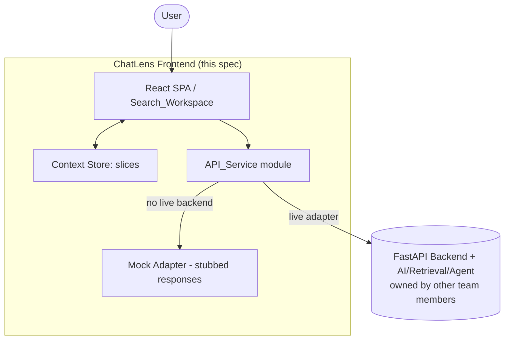
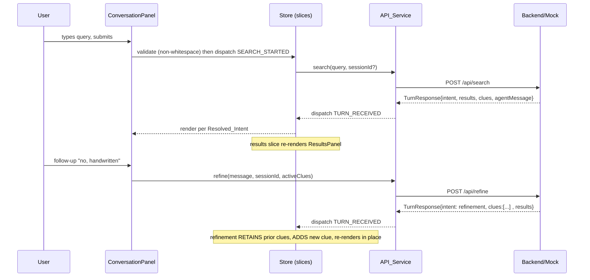
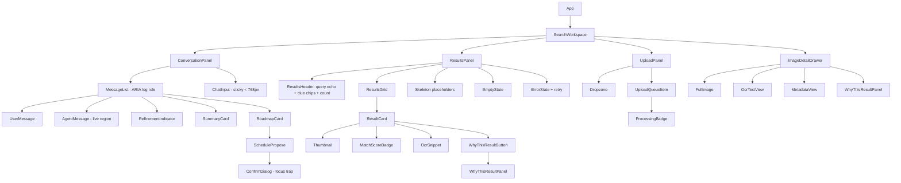
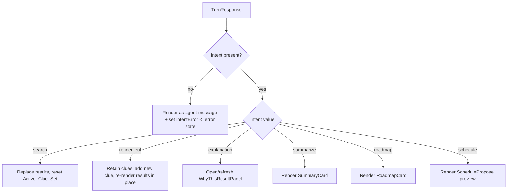

# Design Document

## Overview

This document designs the **ChatLens Frontend**: a browser-based React single-page application (SPA) that delivers the ChatLens core loop **Remember → Search → Refine → Explain → Act**. The scope is strictly the `frontend/` module. Ingestion, OCR, CLIP embeddings, hybrid retrieval, ranking, explanations, and the conversational agent are owned by other team members (see `docs/architecture.md` §15 Component Responsibilities) and are consumed over HTTP through a single isolated API service layer.

Two principles from the repository documentation shape every decision here:

1. **Loose coupling at the network boundary.** `docs/architecture.md` §18 defines parallel-development boundaries; the Frontend talks to the Backend only through one module. This keeps the Frontend buildable and demonstrable while the Backend evolves independently.
2. **Data integrity.** `AGENTS.md` §9 and `docs/decisions.md` §14 ("No Fake Personal History") forbid fabricating retrieval signals, scores, timestamps, personal history, source information, or metadata. The Frontend renders **only** Backend-provided data and omits UI for absent fields rather than inventing placeholders.

The API endpoints in this document are a **proposed contract that requires Backend team sign-off**. They are not implemented in the repository. Per `AGENTS.md` §11 ("Do not build against imaginary or undocumented APIs" as *real*) the Frontend is developed against a mock adapter that returns stubbed responses, so it never depends on any endpoint being confirmed.

### Key design decisions

| Decision | Choice | Rationale |
|---|---|---|
| Build tool | Vite + React + TypeScript | Fast dev server and build, minimal config. Satisfies "no heavyweight framework beyond React and its build tooling" (Req 21.4; `AGENTS.md` §7). |
| State management | **React Context + useReducer**, one store split into slices | Requirement 21.3 explicitly permits Context+useReducer *or* a lightweight store. Context+useReducer adds **zero dependencies** (`AGENTS.md` §7: "Do not add dependencies without justification"), keeps reducers as pure functions ideal for property-based testing, and is sufficient for a single-workspace app. Zustand was considered but rejected: it adds a dependency for benefit we do not need at this scale. |
| Network boundary | Single `api/` module (`API_Service`) with a live adapter and a mock adapter behind one interface | Req 17.1, 17.3, 17.4. Everything else imports the typed service, never `fetch` directly. |
| Language | TypeScript | Typed request/response models make the proposed contract explicit and enable the data-integrity rules to be enforced by the type system. |

## Architecture

### System context



The Frontend is one page (the `Search_Workspace`). All server communication funnels through `API_Service`. When no live Backend is configured, `API_Service` swaps in the mock adapter and the app runs fully offline for development and demos. This directly satisfies Requirements 17.1–17.4.

### Runtime data flow (search → refine → explain → act)



### Module layout

```
frontend/
├── index.html
├── package.json
├── vite.config.ts
├── tsconfig.json
└── src/
    ├── main.tsx                     # React entry, mounts <App/>
    ├── pages/
    │   └── SearchWorkspace.tsx      # the single page; hosts the two panels
    ├── api/
    │   ├── client.ts                # API_Service: the ONLY module issuing HTTP
    │   ├── adapters/
    │   │   ├── httpAdapter.ts        # live adapter (fetch) against proposed contract
    │   │   └── mockAdapter.ts        # stubbed responses for offline/no-backend
    │   ├── contract.ts               # proposed endpoint constants + JSDoc "PROPOSED"
    │   └── types.ts                  # typed request/response models
    ├── state/
    │   ├── store.tsx                 # Context provider + root reducer composition
    │   ├── conversation.slice.ts
    │   ├── results.slice.ts
    │   ├── ingestion.slice.ts
    │   ├── actions.slice.ts
    │   └── ui.slice.ts
    ├── features/
    │   ├── conversation/            # ConversationPanel, MessageList, ChatInput, cards
    │   ├── results/                 # ResultsPanel, ResultsHeader, ResultsGrid, ResultCard
    │   ├── explanation/             # WhyThisResultPanel, ExplanationSignal item
    │   ├── ingestion/               # UploadPanel, Dropzone, UploadQueueItem, ProcessingBadge
    │   └── actions/                 # SummaryCard, RoadmapCard, SchedulePropose, ConfirmDialog
    ├── components/                  # shared presentational primitives (Chip, Badge, Skeleton, Drawer, IconText)
    ├── hooks/                       # useSlice selectors, useMediaQuery, useFocusTrap, useOnlineStatus
    ├── styles/                      # global CSS, tokens, responsive breakpoints
    └── utils/                       # validation (isBlank), altText derivation, guards
```

This satisfies Requirement 21.1–21.4: a standalone `frontend/` module organized into `api`, `components`, `features`, `state`, `hooks`, `pages`, `styles`, and `utils`, with state split into conversation, results, ingestion, actions, and ui slices, and no framework beyond React + Vite.

## Components and Interfaces

### Component hierarchy



### Interface responsibilities (selected)

- **SearchWorkspace** (`pages/`): chooses two-pane vs single-column/tabbed layout from viewport width (Req 1, 19). Hosts panels and the drawer.
- **ConversationPanel**: owns the unified search/chat input and the `Session_Transcript`. Exposes the transcript with `role="log"` and announces agent turns through an `aria-live` region (Req 20.3). Shows an in-progress indicator during an agent turn (Req 9.5).
- **ChatInput**: single unified input for both search and conversation (Req 2.1). Shows example placeholder text when empty (Req 2.2). Rejects whitespace-only submissions in `utils/validation.ts` before dispatch (Req 2.4).
- **MessageList**: renders each transcript turn. An `AgentMessage` is rendered **according to `Resolved_Intent`** (Req 5) via an intent switch, not by parsing text.
- **ResultsPanel** + **ResultsHeader**: renders echoed query, result count, and `Active_Clue_Set` chips (Req 6). Shows skeletons during retrieval (Req 9.4), a refining indicator during refinement (Req 4.4), empty states (Req 10), and error state with retry (Req 11.1).
- **ResultCard**: renders **only** fields present in its payload; omits UI for any absent field (Req 3.2, 3.3, 18.2). Provides a "Why this result?" trigger (Req 3.4) and is keyboard-focusable/selectable for summarize (Req 3.5).
- **WhyThisResultPanel**: renders each Backend `Explanation_Signal` as an icon+text checklist item, exactly those present and no more; shows a Match_Score only as supporting context; shows an explanation-not-available state when there are no signals (Req 7, 20.6).
- **UploadPanel / Dropzone / UploadQueueItem**: drag-drop + file picker, multi-file, client-side type/size validation, per-file error + retry, per-file `ProcessingBadge`; never runs OCR/CLIP (Req 8, 9.1–9.3, 11.2, 11.5).
- **ImageDetailDrawer**: full image, OCR text, available metadata, and an embedded explanation panel; omits absent metadata; full-screen below 768px (Req 16).
- **ConfirmDialog**: modal with explicit confirm and cancel; traps focus while open (Req 14, 20.4). No schedule confirmation is sent unless the user activates confirm (Req 14.5).

## Data Models

All models are TypeScript interfaces in `src/api/types.ts`. Optional fields (`?`) encode the data-integrity rule: when the Backend omits a field, it is `undefined` and the corresponding UI is omitted (Req 3.3, 16.3, 18.2).

```ts
// ---- Retrieval / results ----
export type ExplanationSignalType = 'ocr' | 'semantic' | 'visual' | 'metadata' | 'clue';

export interface ExplanationSignal {
  type: ExplanationSignalType;
  label: string;   // Backend-provided human text, e.g. 'OCR matched "OSI Model"'
  icon: string;    // icon key resolved to an icon component; paired with text (never color alone)
}

export interface SearchResult {
  id: string;
  thumbnailUrl: string;
  fullUrl?: string;
  ocrSnippet?: string;
  matchScore?: number;                 // supporting context only, never sole explanation
  sourceTag?: string;                  // source or type tag
  metadata?: Record<string, string>;   // only keys the Backend supplies
  explanation?: ExplanationSignal[];   // may be embedded or fetched separately
}

// ---- Conversation / agent turns ----
export type ResolvedIntent =
  | 'search' | 'refinement' | 'explanation'
  | 'summarize' | 'roadmap' | 'schedule';

export interface MemoryClue {
  id: string;
  label: string;        // e.g. "handwritten", "large diagram"
}

export interface TurnResponse {
  sessionId: string;
  intent?: ResolvedIntent;      // Resolved_Intent; if absent -> error fallback (Req 5.3)
  agentMessage: string;
  clues?: MemoryClue[];         // clue set the Backend attributes to this turn
  results?: SearchResult[];     // present for search/refinement turns
}

// ---- Actions ----
export interface SummaryResponse {
  sessionId: string;
  summary: string;
  usedImageIds: string[];       // which memories were used (Req 12.2)
}

export interface RoadmapStep {
  order: number;
  title: string;
  detail?: string;
}
export interface RoadmapResponse {
  sessionId: string;
  steps: RoadmapStep[];         // rendered exactly as supplied (Req 13.2)
}

export interface ProposedEvent {
  title: string;
  start: string;                // ISO string supplied by Backend
  end?: string;
  notes?: string;
}
export interface ScheduleProposal {
  sessionId: string;
  events: ProposedEvent[];      // preview shown before confirmation (Req 14.1)
}

// ---- Ingestion ----
export type ProcessingStatus =
  | 'uploaded' | 'processing' | 'indexed' | 'ready' | 'failed';

export interface ImageStatus {
  imageId: string;
  status: ProcessingStatus;
}
```

### Request models

```ts
export interface SearchRequest { query: string; sessionId?: string; }
export interface RefineRequest { message: string; sessionId: string; activeClues: MemoryClue[]; }
export interface SummarizeRequest { sessionId: string; imageIds: string[]; }
export interface RoadmapRequest { sessionId: string; imageIds: string[]; }
export interface ScheduleProposeRequest { sessionId: string; roadmap: RoadmapStep[]; }
export interface ScheduleConfirmRequest { sessionId: string; events: ProposedEvent[]; }
```

### State shape (Context + useReducer slices)

```ts
export interface ConversationState {
  sessionId: string | null;
  messages: TurnTranscriptEntry[];   // ordered user + agent turns (Req 4.1, 15.1)
  activeClues: MemoryClue[];         // Active_Clue_Set
  turnInProgress: boolean;           // agent-turn indicator (Req 9.5)
  intentError: boolean;              // set when a turn omits Resolved_Intent (Req 5.3)
}

export interface ResultsState {
  items: SearchResult[];             // in Backend-provided order (Req 3.1)
  echoedQuery: string;
  selectedIds: string[];             // for summarize (Req 3.5, 12.3)
  loading: boolean;                  // skeletons (Req 9.4)
  refining: boolean;                 // refining indicator (Req 4.4)
  error: string | null;              // retrieval error state (Req 11.1)
}

export interface IngestionState {
  queue: UploadItem[];               // {id, file, validation, status, error?}
}

export interface ActionsState {
  summary: SummaryResponse | null;
  roadmap: RoadmapResponse | null;
  proposal: ScheduleProposal | null;
  error: string | null;
}

export interface UiState {
  drawerOpenForId: string | null;    // ImageDetailDrawer
  confirmDialogOpen: boolean;        // ConfirmDialog (Req 14.2)
  offline: boolean;                  // offline indicator (Req 11.6)
}
```

### Representative reducer actions

```ts
type ConversationAction =
  | { type: 'SESSION_STARTED'; sessionId: string }
  | { type: 'USER_MESSAGE_ADDED'; text: string }
  | { type: 'TURN_STARTED' }
  | { type: 'TURN_RECEIVED'; turn: TurnResponse }   // applies intent + clue merge
  | { type: 'CLUE_REMOVED'; clueId: string }
  | { type: 'SESSION_ENDED' };                       // discards transcript (Req 15.3)

type ResultsAction =
  | { type: 'SEARCH_STARTED'; query: string }
  | { type: 'REFINE_STARTED' }
  | { type: 'RESULTS_REPLACED'; items: SearchResult[]; query: string }  // new search (Req 4.5)
  | { type: 'RESULTS_MERGED'; items: SearchResult[] }                    // refinement in place (Req 4.3)
  | { type: 'RESULT_SELECTION_TOGGLED'; id: string }
  | { type: 'RETRIEVAL_FAILED'; message: string };
```

The **clue-merge rule** lives in the conversation reducer: on `TURN_RECEIVED` with `intent === 'refinement'`, the reducer keeps existing `activeClues` and appends any new clue (dedup by `id`); on `intent === 'search'` it replaces results and resets `activeClues` to the turn's clues (or empty). Because reducers are pure functions of `(state, action)`, they are the primary target for property-based testing.

## API Service Design

`src/api/client.ts` exposes a single typed `API_Service`. It selects an adapter at construction: the **http adapter** when a live Backend base URL is configured, otherwise the **mock adapter** (Req 17.3, 17.4). No other module performs network I/O (Req 17.1).

```ts
export interface ApiService {
  search(req: SearchRequest): Promise<TurnResponse>;
  refine(req: RefineRequest): Promise<TurnResponse>;
  getExplanation(imageId: string): Promise<ExplanationSignal[]>;
  summarize(req: SummarizeRequest): Promise<SummaryResponse>;
  roadmap(req: RoadmapRequest): Promise<RoadmapResponse>;
  proposeSchedule(req: ScheduleProposeRequest): Promise<ScheduleProposal>;
  confirmSchedule(req: ScheduleConfirmRequest): Promise<{ confirmed: boolean }>;
  uploadImage(file: File): Promise<ImageStatus>;
  getImageStatus(imageId: string): Promise<ImageStatus>;
}
```

### Proposed endpoint contract — REQUIRES BACKEND SIGN-OFF (not implemented)

> These endpoints are a **proposed contract**. They are **not present in the repository** and require Backend team sign-off (Req 17.2; `AGENTS.md` §11). The Frontend runs against the mock adapter and does not depend on any of these being implemented (Req 17.4).

| Method | Path | Request | Response |
|---|---|---|---|
| POST | `/api/search` | `SearchRequest` | `TurnResponse` |
| POST | `/api/refine` *(or `/api/search` with `sessionId`)* | `RefineRequest` | `TurnResponse` |
| GET | `/api/results/{id}/explanation` *(or embedded on `SearchResult.explanation`)* | – | `ExplanationSignal[]` |
| POST | `/api/actions/summarize` | `SummarizeRequest` | `SummaryResponse` |
| POST | `/api/actions/roadmap` | `RoadmapRequest` | `RoadmapResponse` |
| POST | `/api/actions/schedule/propose` | `ScheduleProposeRequest` | `ScheduleProposal` |
| POST | `/api/actions/schedule/confirm` | `ScheduleConfirmRequest` | `{ confirmed: boolean }` |
| POST | `/api/images` | multipart file | `ImageStatus` |
| GET | `/api/images/{id}/status` | – | `ImageStatus` |

This table satisfies Requirement 17.5.

### Mock adapter

`mockAdapter.ts` implements `ApiService` with curated, clearly synthetic responses (`AGENTS.md` §9: synthetic data must be distinguishable from genuine user history). It covers the representative queries from `docs/mvp.md` §11 ("Find my CN notes about OSI", handwritten refinement, "confused guy meme", etc.), returns intents that exercise every render path, and supports simulated latency, zero-results, and failure injection so empty/loading/error states (Req 9, 10, 11) can be developed and tested without a Backend.

## Intent-Driven Rendering

Agent turns are rendered by a switch on `TurnResponse.intent` (`Resolved_Intent`). The Frontend never infers intent from message text (Req 5.2).



When `intent` is missing, the turn is still shown as an agent message and an error state is displayed (Req 5.3) rather than guessing. A single `renderTurn(intent)` mapping is the enforcement point and is unit-testable per intent.

## Data Integrity Design

- **Field omission by construction.** Components receive typed payloads with optional fields. Each field renders behind a truthiness/presence guard (`utils/guards.ts`), so an absent field yields no DOM node — no placeholder, no `"N/A"`, no zero score (Req 3.3, 16.3, 18.1, 18.2).
- **No fabrication.** The Frontend never synthesizes descriptions, history, scores, or reasons. `WhyThisResultPanel` renders exactly the `explanation` array it is given (Req 7.2, 7.3, 18.3).
- **Match_Score handling.** Rendered only when present, only as supporting context beside signals, never as the sole explanation (Req 7.4).
- **Alt-text derivation.** `utils/altText.ts` derives image alt text from Backend OCR or metadata when present; otherwise it returns a fixed, meaningful, non-fabricated fallback (e.g. "Stored image, no text available") — it never invents a description of image contents (Req 20.5).

## Responsive Design

Breakpoints (`styles/` tokens, applied via CSS and a `useMediaQuery` hook):

| Condition | Behavior | Requirement |
|---|---|---|
| width ≥ 1024px | Two-pane layout (Conversation + Results) | 1.2, 19.1 |
| width < 1024px | Single-column stacked or tabbed layout | 1.3, 19.2 |
| width < 768px | ChatInput sticky at bottom; ImageDetailDrawer full-screen; touch targets ≥ 44×44px | 1.4, 16.4, 19.3 |

## Accessibility Design

- **Keyboard navigation** across chat input, result cards, and the detail drawer (Req 20.1); every interactive element reachable and operable by keyboard.
- **Visible focus** indicator on the focused element (Req 20.2).
- **Transcript semantics**: `MessageList` uses `role="log"`; new agent turns announced via an `aria-live` region (Req 20.3).
- **Focus trap** inside `ConfirmDialog` while open, restoring focus to the trigger on close (Req 20.4), via `useFocusTrap`.
- **Icon + text** for every `Explanation_Signal`, never color alone (Req 20.6).
- **Alt text** as described in Data Integrity (Req 20.5).

Full WCAG conformance cannot be asserted from automated checks alone; it requires manual testing with assistive technologies and expert review. Automated axe checks are a floor, not proof.

## Correctness Properties

The statements in this section describe characteristics or behaviors that should hold true across all valid executions of the system — each is essentially a formal statement about what the system should do. Such statements serve as the bridge between human-readable specifications and machine-verifiable correctness guarantees.

Property-based testing applies well to this Frontend because its core logic is expressed as **pure functions**: reducers `(state, action) => state`, the query-validation predicate, the intent→render mapping, the width→layout mapping, the field-presence rendering rule, the upload-validation partition, and the alt-text derivation. Each has universal properties over large input spaces. Each property below was derived from the prework analysis, and redundant criteria were consolidated (e.g. the field-presence rule unifies Requirements 3.3, 16.3, and 18.2).

### Property 1: Query sendability tracks non-whitespace content

*For any* string, the Frontend issues a search/refine request **if and only if** the string contains at least one non-whitespace character; whitespace-only strings (spaces, tabs, newlines, and unicode whitespace) never produce a request through the API_Service.

**Validates: Requirements 2.3, 2.4**

### Property 2: Rendering reflects exactly the fields present, with no fabrication

*For any* `SearchResult` or metadata payload with an arbitrary subset of optional fields present, the rendered output contains the UI element for a field **if and only if** that field is present in the payload, contains no placeholder value for an absent field, and contains no description, reason, score, or history text that is not present in the payload.

**Validates: Requirements 3.2, 3.3, 16.2, 16.3, 18.1, 18.2, 18.3**

### Property 3: Result cards are one-per-result in Backend order

*For any* list of results returned by the Backend, the Results_Panel renders exactly one Result_Card per result, in the same order as the list, and the displayed result count equals the length of the list.

**Validates: Requirements 3.1, 6.2**

### Property 4: Refinement retains prior clues and adds the new clue in place

*For any* prior `Active_Clue_Set` and any turn resolved as a refinement, the resulting clue set equals the prior set with the new clue added (deduplicated by id), and the results are re-rendered in place rather than reset.

**Validates: Requirements 4.3**

### Property 5: A new search resets clues and replaces results

*For any* prior state and any turn resolved as a new search, the resulting `Active_Clue_Set` no longer contains the previous clues and the result list is replaced by the new turn's results.

**Validates: Requirements 4.5**

### Property 6: Transcript preserves order, is discarded on end, and is never persisted

*For any* sequence of user and agent turns, the `Session_Transcript` order equals the dispatch order; applying `SESSION_ENDED` yields an empty transcript; and no sequence of turns writes the transcript to `localStorage` or `sessionStorage`.

**Validates: Requirements 4.1, 15.1, 15.2, 15.3**

### Property 7: Rendering depends only on Resolved_Intent, not on message text

*For any* agent turn that includes a `Resolved_Intent`, the selected render path is a function of the intent value alone; changing the message text while holding the intent fixed does not change the render path.

**Validates: Requirements 5.1, 5.2**

### Property 8: Clue chips correspond to the active set and removal re-queries the reduced set

*For any* non-empty `Active_Clue_Set`, the results header renders exactly one removable chip per clue; and *for any* clue removed, the re-query issued through the API_Service carries the active set minus exactly that clue together with the `Session_Id`.

**Validates: Requirements 6.1, 6.3**

### Property 9: Explanation panel renders exactly the payload signals as icon-plus-text

*For any* explanation signal array, the Explanation_Panel renders exactly one icon-plus-text checklist item per signal and no additional items; where a Match_Score is present it is shown as supporting context alongside the signals and never as the sole content; and where the array is empty an explanation-not-available state is shown.

**Validates: Requirements 7.1, 7.2, 7.3, 7.4, 20.6**

### Property 10: Upload validation partitions files correctly

*For any* set of added files, each file that passes client-side type and size validation is queued for sending and each file that fails is marked with an error message, with the valid files unaffected by the presence of invalid ones.

**Validates: Requirements 8.2, 8.3, 8.4**

### Property 11: Processing status maps to the correct indicator

*For any* `Processing_Status` value, the Frontend displays a processing indicator when the status is uploaded, processing, or indexed, and a ready indicator when the status is ready.

**Validates: Requirements 9.1, 9.2, 9.3**

### Property 12: Retry resends the identical failed request

*For any* failed request, activating its retry control resends a request whose payload is identical to the original failed request.

**Validates: Requirements 11.4**

### Property 13: Summarize sends exactly the selected identifiers

*For any* selection of Result_Card items, the summarize request carries exactly the identifiers of the selected items together with the `Session_Id`, and the rendered Summary_Card reports exactly the Backend-provided used identifiers.

**Validates: Requirements 12.2, 12.3**

### Property 14: Roadmap renders exactly the supplied steps in order

*For any* roadmap response, the Roadmap_Card renders exactly the supplied steps, in the supplied order, and adds no step not present in the response.

**Validates: Requirements 13.1, 13.2**

### Property 15: A schedule confirmation is sent only after explicit confirmation

*For any* sequence of Confirm_Dialog interactions, a schedule-confirm request is sent **if and only if** the user activated the confirm control; activating cancel or closing the dialog sends no confirmation.

**Validates: Requirements 14.3, 14.4, 14.5**

### Property 16: Viewport width maps to the correct layout mode

*For any* viewport width, the layout mode is two-pane when the width is at least 1024px, single-column (stacked/tabbed) when below 1024px, and additionally applies the sub-768px rules (sticky input, full-screen detail drawer) when the width is below 768px.

**Validates: Requirements 1.2, 1.3, 1.4, 16.4, 19.1, 19.2**

### Property 17: Alt text is derived when available and falls back without fabrication

*For any* result, the derived image alt text is non-empty; it is derived from the Backend OCR or metadata when either is present; and when both are absent it equals a fixed, meaningful fallback string rather than a fabricated description of the image contents.

**Validates: Requirements 20.5**

## Error Handling

The Frontend treats every server interaction as fallible and every response as untrusted input to be validated before rendering.

- **Retrieval failures** (`search`/`refine`): the results slice enters an error state and the Results_Panel shows a retrieval error with a retry control that resends the original request (Req 11.1, 11.4; Property 12).
- **Upload failures** (per file): the failing `UploadQueueItem` shows an error with a per-file retry; other files are unaffected (Req 11.2; Property 10).
- **Action failures** (summarize/roadmap/schedule): the actions slice records the error and the relevant card shows an action error with retry (Req 11.3).
- **Processing failed status**: an image reported `failed` shows a processing-failed state with a retry control (Req 11.5).
- **Missing Resolved_Intent**: the turn is still rendered as an agent message and the conversation slice sets `intentError`, surfacing an error state instead of guessing intent (Req 5.3).
- **Malformed / partial payloads**: optional fields simply render nothing (Property 2). A response missing required fields (e.g. no `sessionId`) is treated as a failed request and routed to the matching error state rather than rendered.
- **Offline**: `useOnlineStatus` (backed by the `navigator.onLine` / `online`/`offline` events) drives an offline indicator; submissions surface the offline state (Req 11.6).
- **Empty results**: a zero-length result list is a valid success, not an error — it renders the no-results state suggesting a Memory_Clue (Req 10.2).

## Testing Strategy

The Frontend uses a dual approach: **unit/component tests** for specific behaviors and edge cases, and **property-based tests** for the universal properties above. Integration is exercised against the mock adapter.

**Recommended tooling** (chosen to add minimal, well-established dependencies per `AGENTS.md` §7):
- **Vitest** — test runner (native Vite integration, fast).
- **React Testing Library** — component/DOM assertions from the user's perspective.
- **fast-check** — property-based testing for the pure logic and rendering rules.
- **jest-axe / axe-core** — automated accessibility smoke checks (a floor, not proof of WCAG conformance).

Run tests once (not in watch mode) with `vitest --run`.

**Property-based tests** (fast-check):
- Implement each of the 17 correctness properties with a **single** property-based test.
- Configure a **minimum of 100 iterations** per property test.
- Tag each test with a comment referencing its property, format:
  `// Feature: chatlens-frontend, Property {number}: {property_text}`
- Do not implement property-based testing from scratch; use fast-check generators for strings (including whitespace/unicode for Property 1), arbitrary result payloads with random subsets of optional fields (Property 2), clue sets (Properties 4, 5, 8), interaction sequences (Property 15), viewport widths (Property 16), and file sets (Property 10).
- Reducers are tested directly as pure functions; rendering properties use React Testing Library inside the fast-check `property` body.

**Unit / component tests** (Vitest + RTL) focus on the EXAMPLE and EDGE_CASE criteria from prework:
- Default screen on load (1.1), empty-input placeholder (2.2), Why trigger presence (3.4), selectable/focusable card (3.5), refining indicator (4.4), intent-missing fallback (5.3), zero-results state (10.2), empty upload-queue and onboarding states (10.1, 10.3), per-surface error states (11.1–11.3), processing-failed retry (11.5), offline indicator (11.6), Confirm_Dialog controls and focus trap (14.2, 20.4), ARIA log + live region (20.3), keyboard navigation and visible focus (20.1, 20.2), sub-768px touch-target sizing (19.3).

**Integration tests** run the workspace against `mockAdapter` to exercise the full loop from `docs/mvp.md` §11 (search "CN notes about OSI" → refine "handwritten" → refine "large diagram" → why-this-result → summarize → roadmap → schedule propose → confirm), verifying that refinement preserves prior intent and enriches results (Property 4) and that scheduling stays gated behind confirmation (Property 15).

**Not property-tested** (per the PBT guidance): architectural/structural constraints (module layout 21.x, API_Service-only network rule 17.1, endpoints-documented-as-proposed 17.2/17.5) are verified by lint rules and a structure/config smoke check, not by PBT; and full WCAG conformance requires manual assistive-technology testing and expert review beyond automated axe checks.

## Requirements Coverage Map

| Requirement | Design coverage |
|---|---|
| 1 Search Workspace Layout | Architecture (module layout), Responsive Design, Property 16 |
| 2 Natural-Language Search Input | ChatInput, Data Models (validation), Property 1 |
| 3 Ranked Result Cards | Component hierarchy (ResultCard), Data Integrity, Properties 2, 3 |
| 4 Conversational Refinement | Runtime data flow, conversation slice clue-merge, Properties 4, 6 |
| 5 Intent-Driven Rendering | Intent-Driven Rendering section, Error Handling, Property 7 |
| 6 Active Memory Clue Chips | ResultsHeader, conversation/results slices, Properties 3, 8 |
| 7 Why This Result | WhyThisResultPanel, Data Integrity, Property 9 |
| 8 Image Upload and Ingestion | UploadPanel components, Property 10 |
| 9 Processing and Loading States | ProcessingBadge, results/ingestion slices, Property 11 |
| 10 Empty States | ResultsPanel/UploadPanel states, unit tests |
| 11 Error States and Retry | Error Handling section, Property 12 |
| 12 Summarization Action | actions slice, SummaryCard, Property 13 |
| 13 Roadmap Generation | RoadmapCard, Property 14 |
| 14 Schedule Requires Confirmation | ConfirmDialog, actions slice, Property 15 |
| 15 In-Session Transcript Only | conversation slice, Property 6 |
| 16 Image Detail View | ImageDetailDrawer, Data Integrity, Properties 2, 16 |
| 17 Proposed API Contract & Mock | API Service Design, mock adapter, smoke checks |
| 18 Data Integrity | Data Integrity Design, Property 2 |
| 19 Responsive Presentation | Responsive Design, Property 16, unit test (19.3) |
| 20 Accessibility | Accessibility Design, Properties 9, 17, unit tests |
| 21 Module Structure & Build Tooling | Module layout, Key design decisions, structure smoke check |
